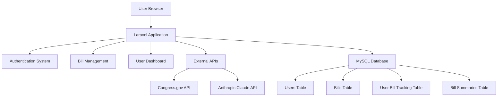

# Design Document

## Overview

The Congressional Bill Tracker is a Laravel 12 web application that provides citizens with access to congressional bill information from both the House and Senate. The application integrates with external APIs to fetch bill data, uses Anthropic's Claude API for AI-powered bill summaries, and provides user authentication for personalized bill tracking.

The system follows a traditional MVC architecture with Laravel's built-in authentication, Eloquent ORM for data management, and a responsive frontend built with Blade templates and Tailwind CSS.

## Architecture

### High-Level Architecture



### Technology Stack

- **Backend**: Laravel 12 (PHP 8.2+)
- **Frontend**: Blade templates with Tailwind CSS 4.0
- **Database**: MySQL/SQLite
- **Authentication**: Laravel's built-in authentication
- **HTTP Client**: Laravel HTTP Client (Guzzle)
- **Testing**: Pest PHP
- **Build Tools**: Vite

## Components and Interfaces

### 1. Authentication System

**Components:**
- `AuthController` - Handles login/logout/registration
- `User` model - Eloquent model for user data
- Authentication middleware

**Interfaces:**
- Registration form with email/password validation
- Login form with remember me option
- Password reset functionality (Laravel default)

### 2. Bill Management System

**Components:**
- `BillController` - Handles bill display and search
- `Bill` model - Eloquent model for bill data
- `BillService` - Business logic for bill operations
- `CongressApiService` - External API integration
- `AnthropicService` - AI summary generation

**Interfaces:**
- Bill listing page with search and filtering
- Bill detail page with full information
- AI summary display with loading states

### 3. Bill Tracking System

**Components:**
- `UserBillController` - Handles user bill tracking
- `UserBill` model - Pivot model for user-bill relationships
- Dashboard controller for tracked bills

**Interfaces:**
- Track/untrack buttons on bill pages
- User dashboard with tracked bills list
- Bill status updates and notifications

### 4. External API Integration

**Components:**
- `CongressApiService` - Fetches bill data from Congress.gov API
- `AnthropicService` - Generates AI summaries using Claude API
- Scheduled jobs for data synchronization

## Data Models

### User Model
```php
class User extends Authenticatable
{
    protected $fillable = ['name', 'email', 'password'];
    
    public function trackedBills()
    {
        return $this->belongsToMany(Bill::class, 'user_bills')
                    ->withTimestamps();
    }
}
```

### Bill Model
```php
class Bill extends Model
{
    protected $fillable = [
        'congress_id',
        'title',
        'number',
        'chamber',
        'introduced_date',
        'status',
        'sponsor_name',
        'sponsor_party',
        'sponsor_state',
        'full_text',
        'summary_url'
    ];
    
    protected $casts = [
        'introduced_date' => 'date',
        'cosponsors' => 'array'
    ];
    
    public function trackedByUsers()
    {
        return $this->belongsToMany(User::class, 'user_bills')
                    ->withTimestamps();
    }
    
    public function summary()
    {
        return $this->hasOne(BillSummary::class);
    }
}
```

### BillSummary Model
```php
class BillSummary extends Model
{
    protected $fillable = [
        'bill_id',
        'summary_text',
        'generated_at'
    ];
    
    protected $casts = [
        'generated_at' => 'datetime'
    ];
    
    public function bill()
    {
        return $this->belongsTo(Bill::class);
    }
}
```

### UserBill Pivot Model
```php
class UserBill extends Model
{
    protected $fillable = ['user_id', 'bill_id'];
    
    public function user()
    {
        return $this->belongsTo(User::class);
    }
    
    public function bill()
    {
        return $this->belongsTo(Bill::class);
    }
}
```

## Database Schema

### Migration Structure

1. **users table** (Laravel default with modifications)
   - id, name, email, password, timestamps

2. **bills table**
   - id, congress_id (unique), title, number, chamber, introduced_date
   - status, sponsor_name, sponsor_party, sponsor_state
   - full_text (longtext), summary_url, cosponsors (json)
   - timestamps

3. **bill_summaries table**
   - id, bill_id (foreign key), summary_text (longtext)
   - generated_at, timestamps

4. **user_bills table** (pivot)
   - id, user_id (foreign key), bill_id (foreign key), timestamps

## API Integration

### Congress.gov API Integration

**Service Class: `CongressApiService`**
- Fetches bill data from Congress.gov API
- Handles rate limiting and error responses
- Transforms API data to match internal model structure
- Scheduled job runs daily to sync new bills

**Key Methods:**
- `fetchRecentBills($chamber = null, $limit = 50)`
- `fetchBillDetails($congressId)`
- `syncBillData()` - Called by scheduled job

### Anthropic Claude API Integration

**Service Class: `AnthropicService`**
- Generates AI summaries for bill text
- Handles API authentication and rate limiting
- Caches summaries to avoid regeneration

**Key Methods:**
- `generateSummary($billText)` - Returns AI-generated summary
- `getSummaryForBill($bill)` - Gets cached or generates new summary

## Error Handling

### API Error Handling
- **Congress API failures**: Graceful degradation with cached data
- **Anthropic API failures**: Display error message, allow retry
- **Rate limiting**: Implement exponential backoff
- **Network timeouts**: Configurable timeout values with fallbacks

### User Experience Error Handling
- **Authentication errors**: Clear validation messages
- **Search errors**: Helpful error messages with suggestions
- **Loading states**: Progress indicators for API calls
- **Empty states**: Encouraging messages when no data is available

### Logging Strategy
- Log all external API calls and responses
- Log authentication attempts and failures
- Log bill tracking actions for analytics
- Use Laravel's built-in logging with appropriate levels

## Testing Strategy

### Unit Tests
- **Models**: Test relationships, scopes, and business logic
- **Services**: Test API integrations with mocked responses
- **Controllers**: Test request handling and response formatting

### Feature Tests
- **Authentication flow**: Registration, login, logout
- **Bill browsing**: Search, filtering, pagination
- **Bill tracking**: Add/remove tracked bills
- **AI summaries**: Summary generation and caching

### Integration Tests
- **External API integration**: Test with sandbox/test endpoints
- **Database operations**: Test complex queries and relationships
- **End-to-end workflows**: Complete user journeys

### Test Data Strategy
- **Factories**: Create realistic test data for bills and users
- **Seeders**: Populate development database with sample data
- **Mocking**: Mock external API responses for consistent testing

## Security Considerations

### Authentication & Authorization
- Laravel's built-in authentication with secure password hashing
- CSRF protection on all forms
- Rate limiting on login attempts
- Session security with secure cookies

### API Security
- Store API keys in environment variables
- Validate and sanitize all external API responses
- Implement request signing where supported by APIs

### Data Protection
- Encrypt sensitive data at rest
- Use HTTPS for all communications
- Implement proper input validation and sanitization
- Regular security updates for dependencies

## Performance Optimization

### Database Optimization
- Index frequently queried columns (congress_id, chamber, status)
- Use eager loading for relationships to avoid N+1 queries
- Implement database query caching for expensive operations

### Caching Strategy
- Cache bill summaries to avoid regenerating AI content
- Cache frequently accessed bill data
- Use Redis for session storage and caching

### Frontend Performance
- Lazy loading for bill text content
- Pagination for large bill lists
- Optimize images and assets with Vite
- Use Tailwind CSS purging for smaller bundle sizes